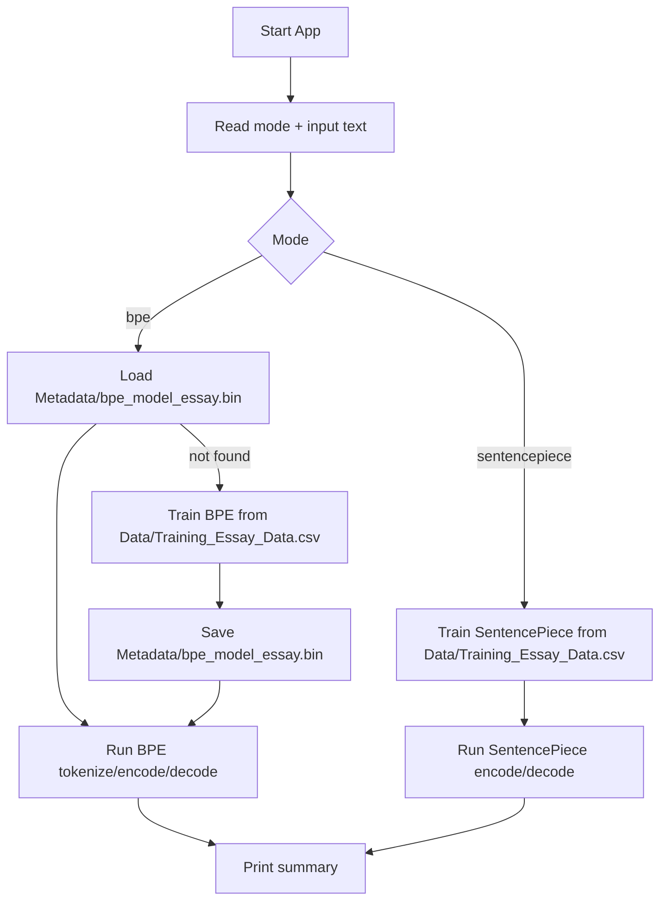

# Tokenization Working Documentation

This document explains the current tokenizer system in this project.

## Implemented Tokenizers

1. `BPE` tokenizer
- Files:
  - `libraries/NKS_Tokenizer/NKS_Tokenizer.h`
  - `libraries/NKS_Tokenizer/NKS_Tokenizer.cpp`
- Features:
  - UTF-8 aware pre-tokenization
  - camelCase split support
  - BPE merge training
  - `##` continuation tokens
  - Binary metadata caching (`Metadata/bpe_model_essay.bin`)
  - Training corpus input supports `.txt` and `.csv` (`text` column for CSV)

2. `SentencePiece`-style tokenizer
- Files:
  - `libraries/NKS_Tokenizer/NKS_SentencePieceTokenizer.h`
  - `libraries/NKS_Tokenizer/NKS_SentencePieceTokenizer.cpp`
- Features:
  - whitespace marker based normalization (`▁` internally)
  - UTF-8 aware segmentation
  - DP/Viterbi-like best-piece path selection
  - Training corpus input supports `.txt` and `.csv` (`text` column for CSV)

## App Flow

- File: `main.cpp`
- Mode selection at runtime:
  - `bpe`
  - `sentencepiece`



## Current Default Data Paths

- Training corpus path: `Data/Training_Essay_Data.csv`
- Converted text corpus file: `Data/Training_Essay_Data.txt`
- Cached BPE metadata: `Metadata/bpe_model_essay.bin`

## Refactor Notes (Magic Number Cleanup)

The code now uses named structures/constants/enums instead of scattered literals.

### BPE
- `BpeTrainingConfig` (in `NKS_Tokenizer`)
  - `mergeOps`
  - `trainingWordLimit`
  - `showProgress`
- `TrainingStage` enum added for stage semantics.
- Named constants for:
  - progress intervals
  - approximate token estimation ratio
  - continuation prefix and boundary markers
  - minimum thresholds

### SentencePiece
- `TrainingConfig` (in `NKS_SentencePieceTokenizer`)
  - `targetVocabSize`
  - `maxPieceChars`
  - `trainingLineLimit`
  - `lowercase`
  - `splitCamelCase`
- `EncodeFallback` enum added.
- Named constants for fallback cost, min thresholds, and reserve factors.

### main.cpp
- `TokenizerMode` enum
- `AppPaths`, `BpeRuntimeConfig`, `SentencePieceRuntimeConfig`
- Shared `TokenizationResult` for mode-independent reporting

## Binary Metadata Format (BPE)

Path: `Metadata/bpe_model_essay.bin`

Stored data:
1. magic header (`NKS_BPE1`)
2. unknown token
3. max subword char length
4. subword count
5. all subwords (length-prefixed)

Benefit:
- avoids retraining on every run
- faster startup on repeated BPE usage

## Progress Output

During first-time BPE training:
- vocabulary load progress (word count interval)
- merge progress (`step/total` and `%`)
- early-stop message when no frequent pair remains

## Pseudocode

### 1) BPE: load or train

```text
function LoadOrTrainBPE(vocabPath, modelPath, cfg):
    tokenizer = CreateBPETokenizer(cfg)

    if tokenizer.loadModel(modelPath):
        return tokenizer

    rows = ReadCorpus(vocabPath) // supports txt or csv(text column)
    words = PreTokenizeAndNormalize(rows, limit=cfg.trainingWordLimit)
    tokenizer.trainBPE(words, mergeOps=cfg.mergeOps, showProgress=cfg.showProgress)
    tokenizer.rebuildVocabularyMaps()
    tokenizer.saveModel(modelPath)
    return tokenizer
```

### 2) BPE: train merges

```text
function TrainBPE(words, mergeOps):
    corpus = words as character symbols + </w>

    repeat step in [1..mergeOps]:
        pairCounts = count adjacent symbol pairs in corpus
        bestPair = argmax(pairCounts)

        if bestPair.count < MIN_FREQUENT_PAIR:
            break

        corpus = merge bestPair everywhere in corpus

    subwordVocab = collect merged symbols from corpus
    maxSubwordChars = max UTF8 char length over subwordVocab
```

### 3) BPE: tokenize / encode / decode

```text
function EncodeBPE(text):
    preTokens = PreTokenize(text)  // whitespace, punctuation, camelCase
    pieces = []

    for token in preTokens:
        if punctuation:
            pieces.push(token)
        else:
            pieces += GreedyLongestSubwordMatch(token)  // add ## for continuation

    ids = map pieces to token ids (or dynamic unknown ids)
    return pieces, ids

function DecodeBPE(ids):
    pieces = map ids to tokens
    join continuation and punctuation with spacing rules
    return text
```

### 4) SentencePiece: training

```text
function TrainSentencePiece(corpusPath, cfg):
    rows = ReadCorpus(corpusPath) // supports txt or csv(text column)
    lines = Normalize(rows, limit=cfg.trainingLineLimit)
    seed = all UTF8 chars from lines
    add seed to vocabulary

    ngrams = count substrings up to cfg.maxPieceChars
    ranked = sort ngrams by frequency then length

    add ranked candidates until cfg.targetVocabSize
    compute log probabilities per piece
```

### 5) SentencePiece: encode (DP)

```text
function EncodeSentencePiece(text):
    normalized = insert ▁ boundary markers + normalize case
    chars = UTF8 split(normalized)

    dp[0] = 0, dp[i] = INF for i>0
    prev[i] = none

    for i in 0..n-1:
        for len in 1..maxPieceChars:
            piece = chars[i:i+len]
            if piece in vocab:
                relax dp[i+len] with piece cost

        if no transition chosen:
            fallback to single char with fallback cost

    backtrack prev[] to produce best piece sequence
```

## GPU/Parallelization Readiness

Current SRP boundaries are preserved for future acceleration:
1. Input normalization / pre-tokenization
2. Subword segmentation (BPE greedy or SP DP)
3. ID mapping
4. Decode / display

This separation allows later replacement of stage 2 or 3 with batched parallel/GPU kernels without changing app I/O flow.
